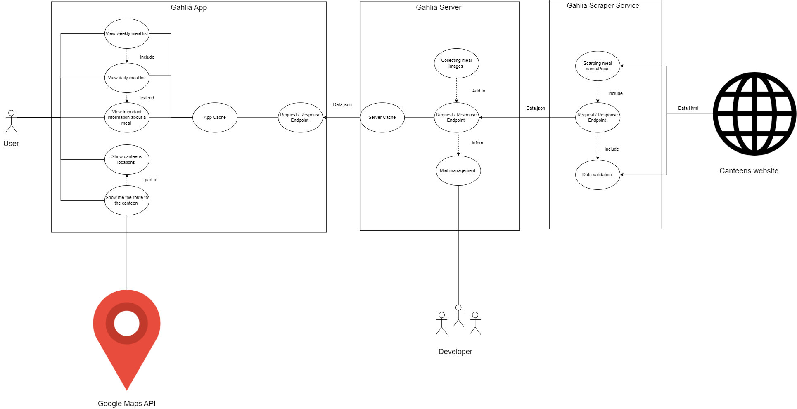

# TASKS in WEEK 3: SRS and MOCKUP

## Table of contents

- [Table of contents]()
- [Introduction](#intro)
  - [Purpose](#Purpose)
  - [Scope](#scope)
  - [References](#references)
  - [Overview](#overview)
- [Overall Description](#description)
  - [Vision](#vision)
  - [Use Case Diagram](#usecasediagram)
  - [Technology Stack](#technologystack)
- [Specific Requirements](#specificrequirements)
  - [Functionality](#functionality)
  - [Usability](#usability)
- [Supporting Information](#supportinginformation)

## 1. Introduction 

### 1.1 Purpose 

This document describes the creation of the Ghalia application, which provides a list of all available meals in the canteens in Karlsruhe.

### 1.2 Scope
<ul>
<li>Navigation Menu: A hamburger menu that extends from the left side and provides access to the other subsystems of the app. </li>
<li>Mensa List: A selection of the 5 supported canteen locations. Selecting one canteen opens it’s meals list </li>
<li>Meals List: Here the meal options of the day are displayed, along with their prices and an option to select a different day. Additionally, a nutrition type is provided (vegetarian, pork, etc.) </li>
<li>Details View: Provides a meal description, an image along with a nutrition score. We may extend the view with further  information. </li>

</ul>

### 1.3 References

| Title                                                     |    Date    | Publishing organization |
| --------------------------------------------------------- | :--------: | ----------------------- |
| [Source Code Repo](https://github.com/GahliaDHBW/Gahlia)  | 20.10.2022 | Gahlia                  |
| [Blog](https://github.com/GahliaDHBW/Gahlia/discussions)  | 20.10.2022 | Gahlia                  |
| [Scraping Code](https://github.com/GahliaDHBW/mensascrap) | 10.12.2022 | Gahlia                  |

### 1.4 Overview

The following chapter provides an overview of this project with a vision and a general use case diagram. The third chapter (Requirements Specification) provides more details on the specific requirements in terms of functionality, usability, and design parameters. Finally, there is a chapter with supporting information.

--- 
## 2. Overall Description

### 2.1 Vision

We would like to develop an easy-to-use Android app with all the necessary meal information for the DHBW student. 

### 2.2 Use Case Diagram

### 2.3 Technology Stack

- GitHub: For version Control and for writting Blogs
- Youtrack: For internal tickets, such as tasks, bugs and user stories
- Cloujer: For webscraping 
- Github Actions: For running Cloujer scripts on Github Servers
- Github Pages: to host the result of webscraping
- VsCode: As IDE for NodeJS (React Native / JS) and Cloujer development
- Nodejs: It is used by React Native
- Figma: For drawing the Mockups
- Icons8: For icons in the App
- Flask: To be able to use Python as a server language
- Python: To add more data to the Cloujre scraping data
- PyCharm: As IDE for python development 
- Micrsoft Azure: To host the Flask server
- React Native: As Cross-platform development technology
- Expo: A development Framework for React Native
- React Native Elements: UI library for React Native
- Testing: Testing User Interactions – Component Tests - Snapshot Test

## 3. Specific Requirements

### 3.1 Functionality

This point structured below show the function of the application. In the coming months, we are going to implement the following steps, to deploy the application.

-  Show canteen list  
-  Show meal list by weekday
-  Show meal details   
-  Show canteens location
-  Routing the way to the canteens   

#### 3.1.1 [👆 Show canteen list](https://github.com/GahliaDHBW/Documentation/blob/main/TASKS%20IN%20WEEK%204.1.md)

The user could see the meal list in the following canteens:

- Mensa Erzbergerstraße
- Caféteria Moltkestraße
- Mensa Moltke
- Mensa am Adenauerring
- Mensa Schloss Gottesaue

#### 3.1.2 Show meal list by weekday

The user can see the meals of any day in the week

#### 3.1.3 Show meal list 

The user can see the available food in every canteens in the point 3.1.1

#### 3.1.4 [👆👆 Show canteens location](https://github.com/GahliaDHBW/Documentation/blob/main/TASKS%20IN%20WEEK%204.2.md)

This feature answers the question, where are the canteens  

#### Routing the way to the canteens   

This feature answers the question, what is the faster way to be the canteens or how long it will take to me in e.g  Mensa Schloss Gottesaue

### The Mockup 
  

 <a href="https://github.com/GahliaDHBW/Documentation/blob/main/TASKS%20IN%20WEEK%206.md">[see more information about it - via looking at the implementation of version 1.0 of the app]</a>

 <a href="https://github.com/GahliaDHBW/Documentation/blob/main/TASKS%20IN%20WEEK%207.md">[see more information about it - via looking at the implementation of version 1.0 of the app]</a> 

### 3.2 Usability

To make the user as comfortable as possible while using the application, we intend to create the user interface to be as clear and intuitive as feasible. To be sure that the previous aims are already achieved, usability test is also realizable. 

--- 
## 4. Supporting Information

For any further information you can contact the Ghalia Team or check our Ghalia Blog. 

Team members:

Konstantin Seeber

Mohamad Naser Alnakeshbandi

Rabar Albl 
