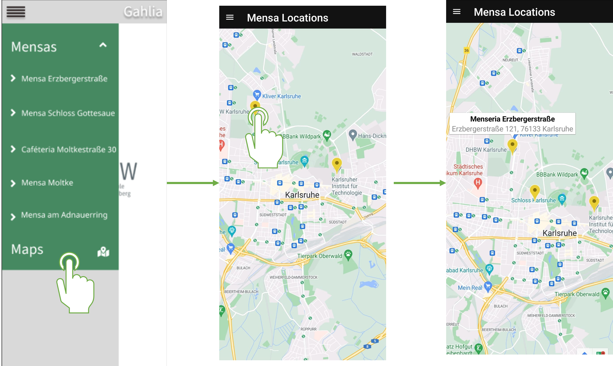
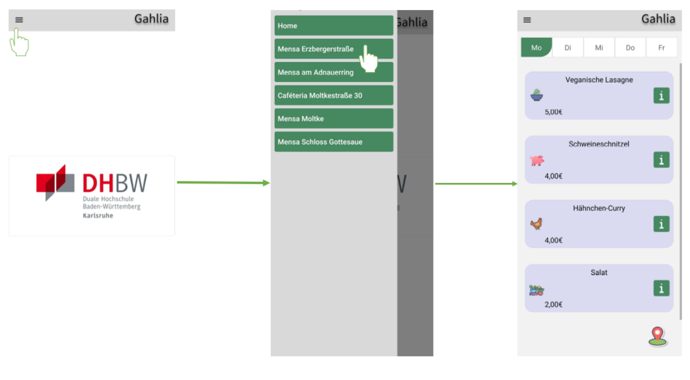
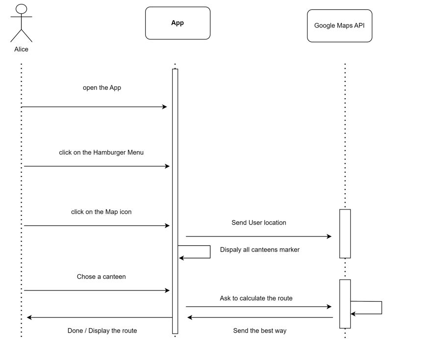

# Use-Case Specification: Show canteens location

## 1. Show canteens location
---

**1.1 Brief Description**

Knowing the availabill meals in all naraly canteens is good but knowing the location of all of them is better. This possibility is important because the user need to jnow if the time he has is enough to go to the x canteen location or not 

Cannteen list:

- Mensa Erzbergerstraße
- Caféteria Moltkestraße
- Mensa Moltke Karlsruhe
- Mensa am Adenauerring
- Mensa Schloss Gottesaue

**1.2 Mockup**

**1.3 Screenshot**

In the screenshot, we see that the user have to select the canteen and then he have to click map icon in the right bottom side on the screen. In order to use the canteen navigation feature. 

However in final version of the application, this feature is going as the we planed in the Mockup. The user does not have to to click on the canteen and then navigate to it as he have to do in the first version of the App. 

**2 Flow of Events**

#### 2.1 Basic Flow

- The user klick on the App icon 
- The user klick on the hambruger menu icon
- The side navbar is displayed   
- The canteens names are displayed  
- The Maps button is displayed 
- The user click on the location marker

#### Activity Diagram

