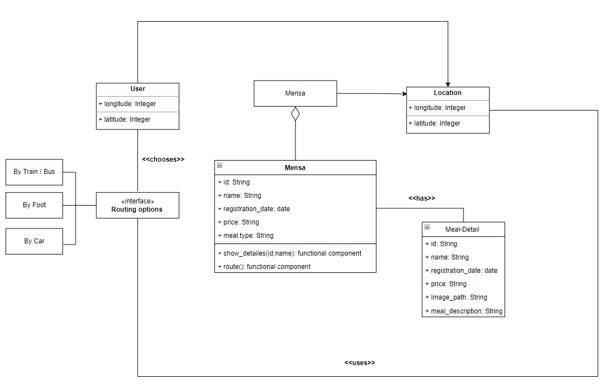

# TASKS in WEEK 5: Class Diagram of the app

Via our tech stack descion, drawing an Class Diagramm for the application was not an easy task for us because the we used mainly JSX in our app there is not any class , what we have is called functional components and not classes. 

Havong said that we convert it to something that look similar to what we have to achieve

