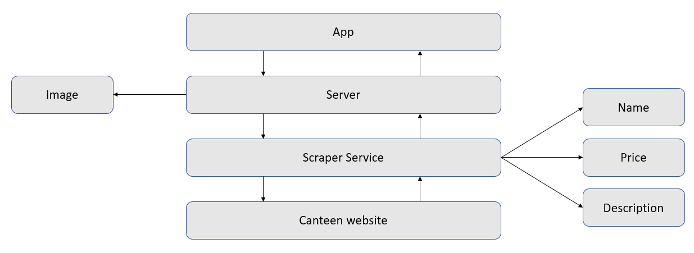

# TASKS in WEEK 7: ASR analysis

This week we discussed the topic _Architecturally Significant Requirements_ and also we have identified the most important quality attributes for our project.

As a result, we have focused on a total of three relevant attributes (**Availability, Performance and Usability**). In addition, we have also defined scenarios for the quality attributes that are likely to occur. The scenarios are shown in the picture below.

### Quality attribute scenarios

----

### Potential Tactics

For us, the issue of **Availability** has a highest priority, as we will scrape the data e.g. Meals from the Mensa-website to use in our application, which means at the same time, that our application is basically completely dependent on the Mensa website. This means, if the structure of the Mensa website is changed, there is a high probability that the scraper will no longer be able to fetch any data.

**Identify errors**: the Scraper will regularly check whether the data can still be retrieved successfully.

**Send an E-Mail**: we will set up an Email-Service so bug reports will be sent to the Development-Team.

**Inform users**: the Application will notify the users that there was an error and will be fixed immediately by the Dev-team.

-----

### Checklist

- **Allocation of Responsibilities**
  
  The Data-Scraper must to work perfectly, if it doesn't, both the user and the development-team 
  must to be informed immediately.

- **Coordination Model**

  If access to the Mensa website is no longer possible, the dev-team and user must be informed.

- **Data Model**

  Data-Scraper and caching must both always be available. If for some reason the data cannot be 
  cached, a request must be sent again to retrieve the data completely.

- **Resource Management**  

  The app has to run as fast as possible, so it is going to store the data as application caches and 
  when it works, the improvement of the caching methods and the availability and performance of the 
  app is going to be the aim of the dev team

--------

### Architecture decisions and design patterns

The project architecture diagram shows how they communicate with each other. Ghalia Scraper Service is going to request the canteen’s website and then it is going to scrape its response. In this way it is going to provide a JSON file with the meal name, price and the meal description. The Server is going to request this JSON and add to the response of it the meal images. Via the internet the App is going to get all the collected / scraped data. 

**How it works?** 

